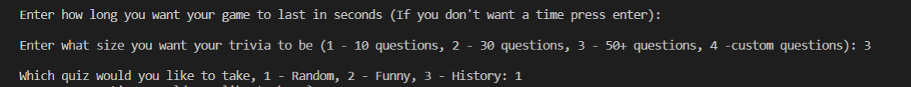

README.md

# triviaGame #

## What is it: ##

== This code is a python program that gives a player questions and checks if the player got the question right.

== The user inputs which mode they want and the program reacts accordingly

== Player can choose which quizzes they want, the amount of time they want, and how many questions they want

== The answers and times are stored in their own file which can be accessed anytime 

## Key Features: ##

--> __Interactive__ Trivia game with two different modes for different amount of players

--> *Premade* quizzes and the abiity to __create__ your own *custom* questions to be implemented into the game

--> ___Self Scoring point system___ that saves points and time per question

## Walkthrough: ##
### Singleplayer ###
#### Step 1 ####
Enter the gamemode you want to choose with the number 1 or 2. Then enter your name so the computer knows your name.

#### Step 2 ####
Enter how long you want the game to last, in case you don't want to have a time limit like the example below press enter. Then choose the size of the quiz you'd like to take (total amount of questions is different), and then the quiz within that size.

#### Step 3 ####
Choose the amount of questions you'd like to complete in your set amount of time, if time is passed program will end or when the amount of questions asked is fulfilled. Then start answering questions *(remember to use proper capitlization)*! If the program counts a question wrong that you should've gotten right press 1 to get it right!

#### Step 4 ####
Once time has run out it returns your total score and time.

### Multiplayer ###
#### Step 1 ####
This game starts similarly to the last game, instead of 1 you press 2. Then you are taken to the same choices again, choose how big you want the quiz to be and which quiz too.

#### Step 2 ####
All you need to do here is enter 0 for the first 2 inputs in the first round. Then you enter how long you want the round to last. If you put in a valid number the timer will start whenever you press return.

#### Step 3 ####
When the round starts the host will be given a question to read out to the players. Based on their response and the time it takes the program will give points accordingly. These points are based on the factor if the player got the question correct or not and if they went over 10 seconds. When the host presses 1, that player will recieve a point, if the host presses 2 that player will lose a point, and if the host presses 3 the points don't change unless if it was over 10 seconds, however the program will factor that in automatically.

#### Step 4 ####
Now the host determines which player did the worst and which one did the best. In case the hose forgot the order of players they can just enter nothing and a list of the players will be returned. In case the host wants to see the score they can open the points.txt file to find out. Once they determine the worst and best player, they enter it in the respective inputs, the worst player is removed and the best player goes first the next round. 

#### Step 5 ####
Repeat the previous steps till there is one player remaining, if you subtract the amount of players to equal 1 that's how many rounds it'll take to get the winner. It should return the player's name with the text "won!!" next to it.

### Extra ###
points.txt looks like this at the end of the game, however each round will update after every round.

When you want to add your own custom quiz this is how you write it. Remember that the question goes on top and the answer goes on the bottom as shown in Question 3.
